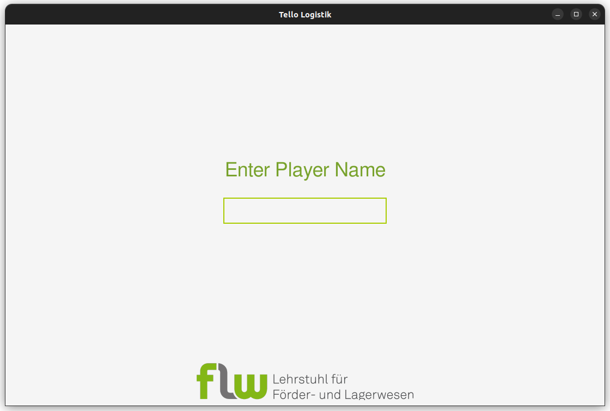
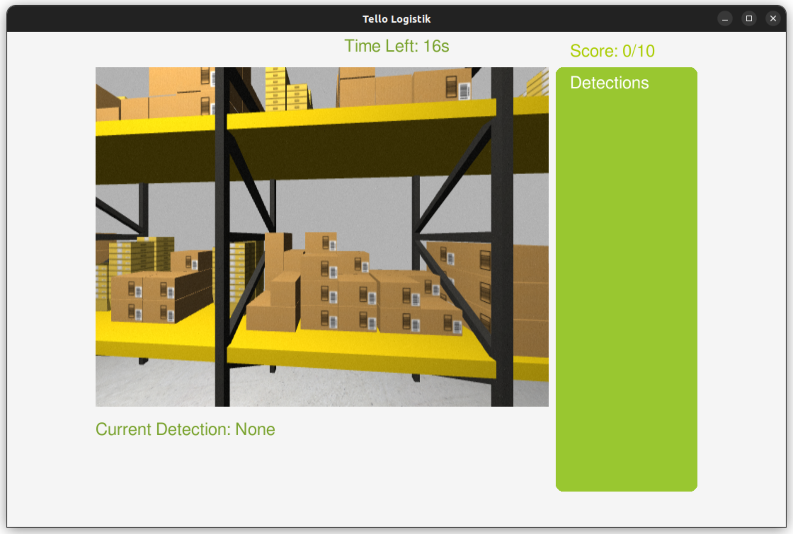
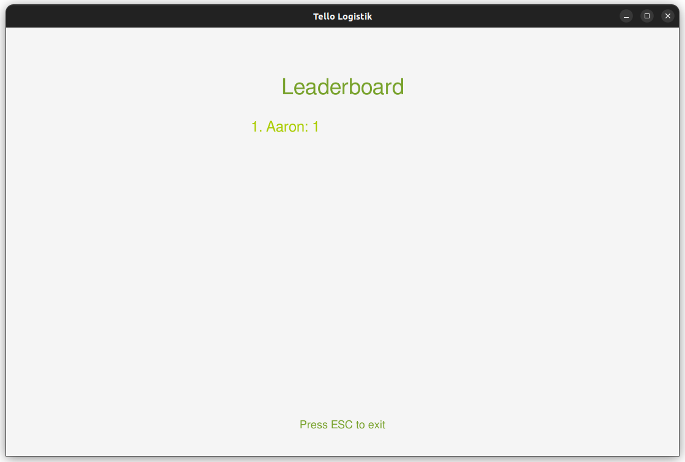

# Tello Logistik Game

This project is a QR code detection game using Pygame and OpenCV, with optional ROS2 camera integration and a persistent YAML-based leaderboard.






## Features
- Detects QR codes from a webcam or a ROS2 image topic (`/image_raw`).
- Game UI with timer, score, and detection list.
- Player login screen.
- Leaderboard saved in `leaderboard.yaml`.
- Detections saved in `detections.yaml`.

## Requirements
- Python 3.10+
- OpenCV (`opencv-python`)
- Pygame
- PyYAML
- (Optional, for ROS2 integration):
  - ROS2 Humble or newer
  - `rclpy`, `cv_bridge`, `sensor_msgs`

## Installation
```bash
pip install -r requirements.txt
# For ROS2 integration, ensure your ROS2 environment is sourced and dependencies installed
```

## Usage

- Run with Webcam (default device 0)
    ```bash
    python3 main.py
    ```

-  Run with a specific webcam device (e.g., device 2)
    ```bash
    python3 main.py --use-device 2
    ```

- Run with ROS2 Image Topic (default: /image_raw)
    ```bash
    python3 main.py --use-topic
    ```

- Run with a specific ROS2 Image Topic
    ```bash
    python3 main.py --use-topic /camera/image_raw
    ```

- On start, enter your player name.
- The game runs for 20 seconds (default, configurable in `main.py`).
- Scan as many unique QR codes as possible.
- Your score and name are saved to `leaderboard.yaml`.
- The leaderboard is displayed after each game.

## File Structure
- `main.py` - Main entry point, handles game loop and CLI args.
- `camera.py` - Camera and QR detection logic (webcam or ROS2 topic).
- `game_ui.py` - Pygame UI drawing functions.
- `leaderboard.py` - Leaderboard save/display logic.

## Submodules Setup

This repository uses two git submodules for simulation and drone resources:

- [`sim_ws/src/small-warehouse-world`](https://github.com/FLW-TUDO/small-warehouse-world)
- [`sim_ws/src/sjtu_drone`](https://github.com/NovoG93/sjtu_drone)

To initialize and update these submodules, run:

```bash
git submodule update --init --recursive
```

If you clone the repository in the future, use:

```bash
git clone --recurse-submodules <repo-url>
```

If you already cloned without `--recurse-submodules`, just run the first command above.

## Notes
- To use ROS2, source your ROS2 environment before running the game.
