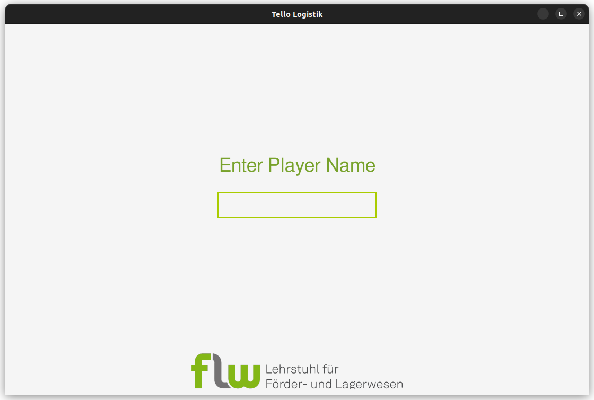
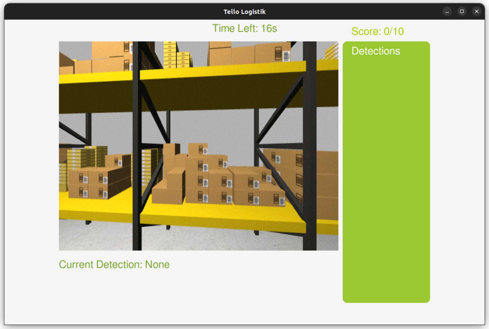
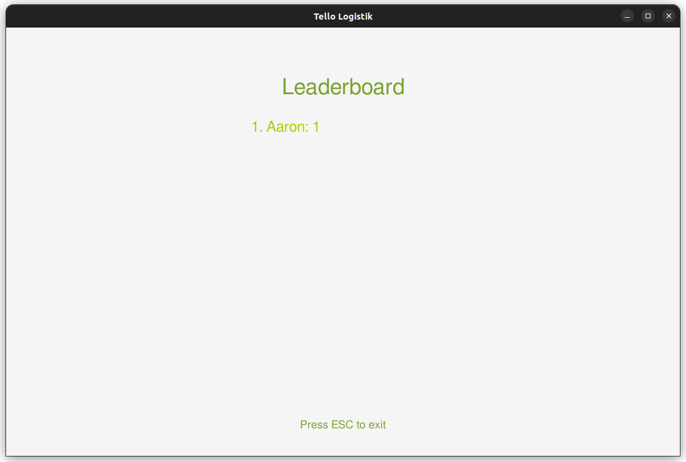

# Tello Logistik Game

This project is a QR code detection game using Pygame and OpenCV, with optional ROS2 camera integration and a persistent YAML-based leaderboard.






## Features
- Detects QR codes from a webcam or a ROS2 image topic.
- **Two UI modes**: Standard and VR (immersive full-screen video with floating overlays).
- Game UI with timer, score, and detection list.
- Player login screen with VR mode toggle.
- Persistent leaderboard saved in `leaderboard.yaml`.
- **Start Again** option after viewing the leaderboard.
- Detections saved in `detections.yaml`.
- Command-line option to reset leaderboard.

## Requirements
- Python 3.10+
- OpenCV (`opencv-python`)
- Pygame
- PyYAML
- (Optional, for ROS2 integration):
  - ROS2 Humble or newer
  - `rclpy`, `cv_bridge`, `sensor_msgs`

## Installation
```bash
pip install -r requirements.txt
# For ROS2 integration, ensure your ROS2 environment is sourced and dependencies installed
```

## Usage

### Running the Game

- Run with Webcam (default device 0)
    ```bash
    python3 main.py
    ```

-  Run with a specific webcam device (e.g., device 2)
    ```bash
    python3 main.py --use-device 2
    ```

- Run with ROS2 Image Topic (default: /image_raw)
    ```bash
    python3 main.py --use-topic
    ```

- Run with a specific ROS2 Image Topic
    ```bash
    python3 main.py --use-topic /camera/image_raw
    ```

- Reset the leaderboard
    ```bash
    python3 main.py --reset-leaderboard
    ```

### Playing the Game

1. **Login Screen**: Enter your player name and optionally toggle VR mode.
2. **Gameplay**: The game runs for 120 seconds. Scan as many unique QR codes as possible.
3. **Scoring**: Your final score (up to a maximum of 20 unique QR codes) is displayed.
4. **Leaderboard**: After the game ends, the leaderboard is automatically shown.
5. **Start Again**: Click "Start Again" to play another round, or "Exit" to quit.

### UI Modes

- **Standard Mode**: Side-by-side layout with video feed, detections panel, and timer.
- **VR Mode**: Immersive full-screen video background with floating UI elements overlaid on the video feed.

## File Structure
- `main.py` - Main entry point, handles game loop and CLI args.
- `camera.py` - Camera and QR detection logic (webcam or ROS2 topic).
- `game_ui.py`, `game_ui_vr.py` - Pygame UI drawing functions with immersive overlay.
- `leaderboard.py` - Leaderboard save/display logic with Start Again functionality.

## Configuration

You can modify game settings in `main.py`:

- `TIMER_SECONDS` - Game duration in seconds (default: 120)
- `SCOREBOARD_TOTAL` - Maximum number of unique QR codes counted toward score (default: 20)
- `WIDTH`, `HEIGHT` - Window dimensions (default: 1100x700)

## Technical Notes

### ROS2 Integration
- When using `--use-topic`, the camera node is created once and reused across game restarts for efficient resource management.
- Supports ROS2 Humble or newer.
- The camera subscription thread runs in the background and is properly cleaned up on exit.

### Camera Resource Management
- In ROS2 mode, a single ROS node persists throughout the application lifetime.
- When restarting the game, only detections are cleared—the camera connection is maintained.
- This prevents resource accumulation and speeds up game restarts.

## Submodules Setup

This repository uses two git submodules for simulation and drone resources:

- [`sim_ws/src/small-warehouse-world`](https://github.com/FLW-TUDO/small-warehouse-world)
- [`sim_ws/src/sjtu_drone`](https://github.com/NovoG93/sjtu_drone)

To initialize and update these submodules, run:

```bash
git submodule update --init --recursive
```

If you clone the repository in the future, use:

```bash
git clone --recurse-submodules <repo-url>
```

If you already cloned without `--recurse-submodules`, just run the first command above.

## Notes
- To use ROS2, source your ROS2 environment before running the game.
- The game window is resizable and the UI adapts accordingly.
- QR codes must be clearly visible to the camera for detection and decoding.
- Green bounding boxes appear around successfully detected and decoded QR codes.
- Each unique QR code is counted only once per game session.
